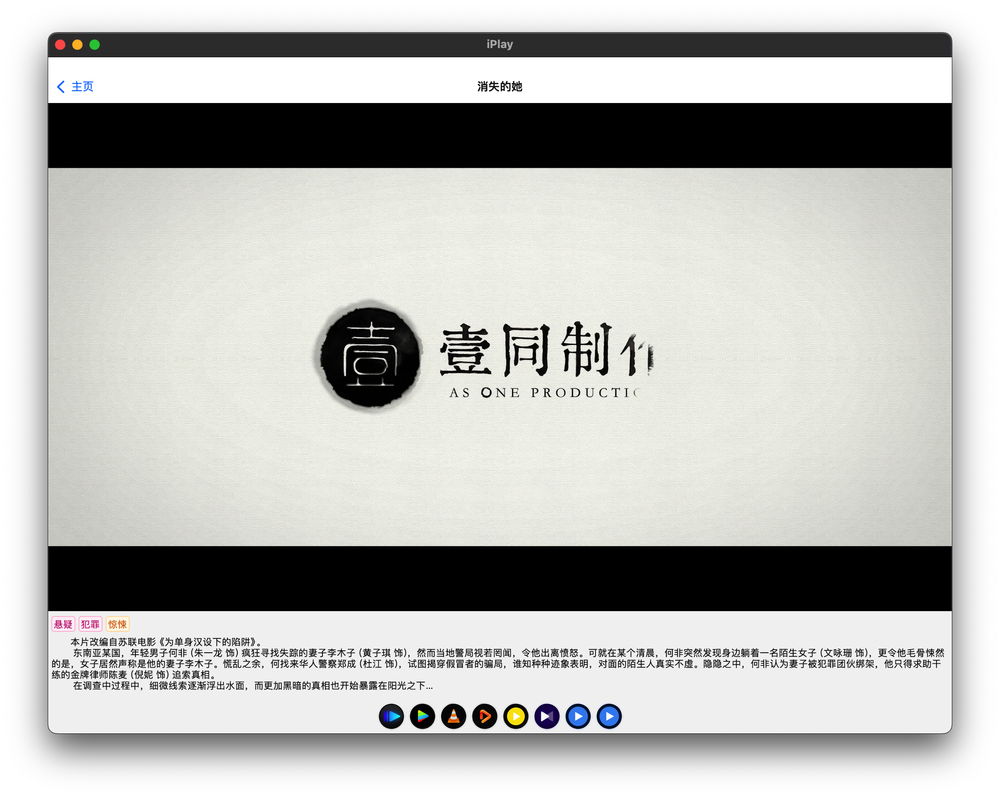
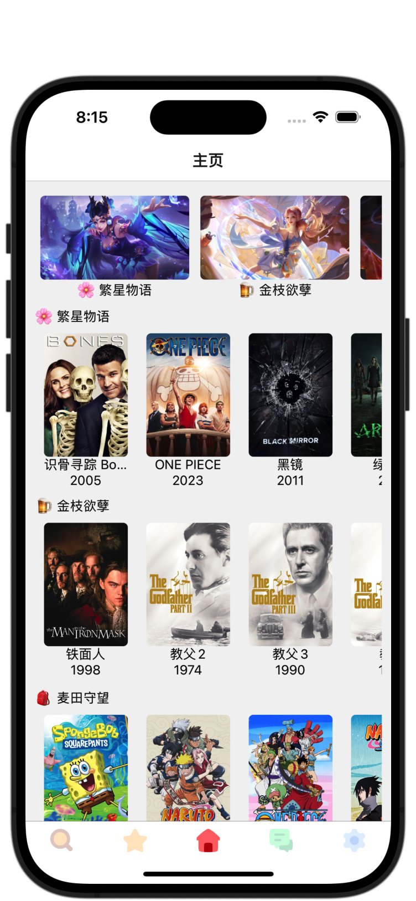
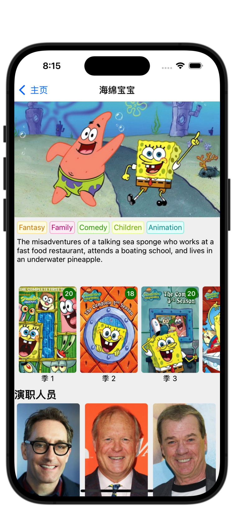
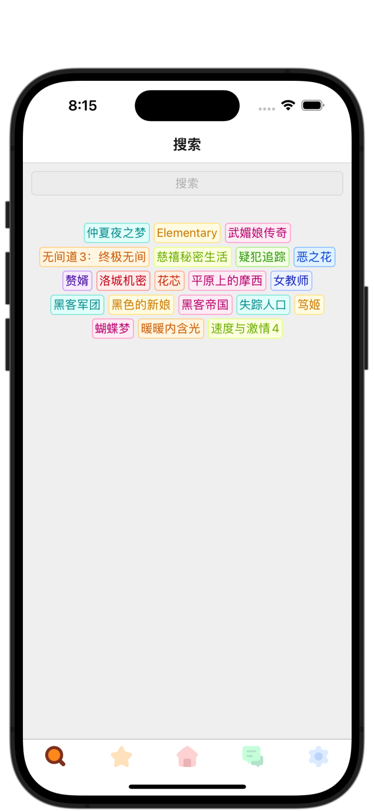
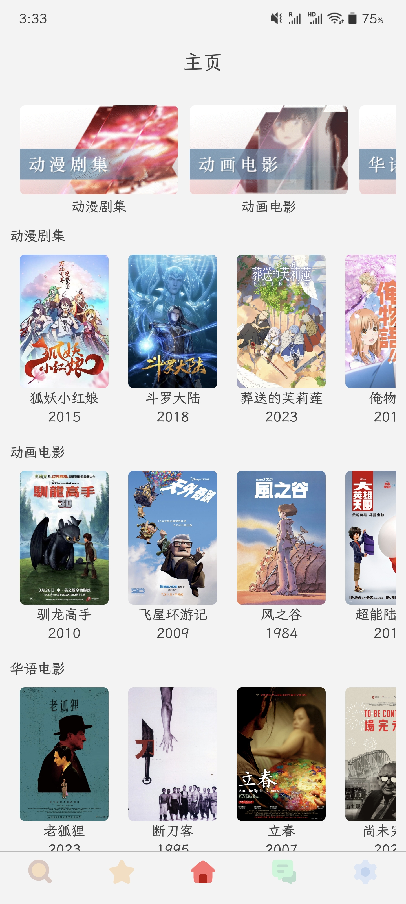
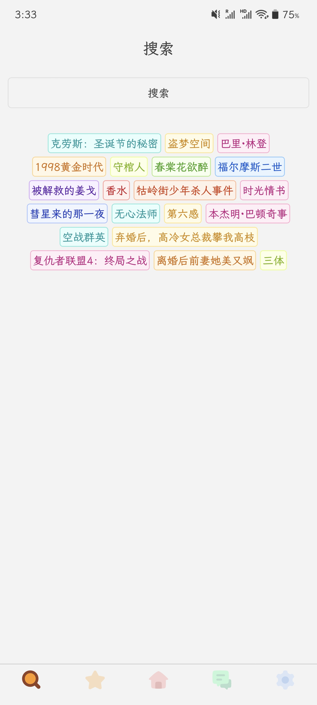
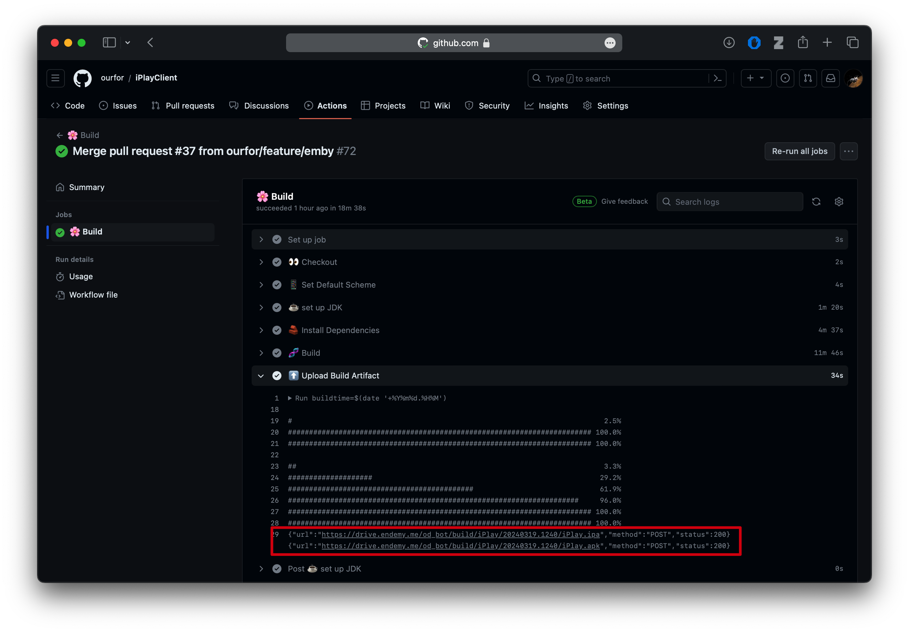

   

<h2 align="center">iPlay</h2>

iPlay is a modern video player for Android and iOS

 

---

### A cross-platform media player

<table>
<tr>
   <td></td>
   <td></td>
</tr>
</table>

<table>
<tr>
   <td></td>
   <td></td>
   <td></td>
</tr>
<tr>
   <td></td>
   <td></td>
   <td></td>
   <td></td>
   <td></td>
   <td></td>
</tr>
</table>

Supports Android and iOS

### Feature

- [x] Support Emby
- [x] Internal mpv player
- [ ] Download video and audio
- [ ] Audio player
- [ ] Support subscribe movie and series
- [ ] User interface
- [ ] Enhance internal player
- [ ] Support Windows

### Development Progress

It is developed in my free time

### Download

- [Android](https://drive.endemy.me/od_bot/build/iPlay/latest/iPlay.apk)
- [iOS](https://drive.endemy.me/od_bot/build/iPlay/latest/iPlay.ipa)

Download the development package

## Third-party Dependencies

### Player

- [MPVKit](https://github.com/cxfksword/MPVKit.git)
- [android-mpv](https://github.com/mpv-android/mpv-android)

## UI Design

- [Player UI Design](https://www.figma.com/file/2LMy996hxF2DZ2jB8eU0Fv/Video-Player-For-Web-%26-Mobile-(Community)?type=design&node-id=18-4120&mode=design&t=4xkVhM84OdC0jy9x-0)
- [Icon](https://www.figma.com/file/9Df5CaFUEomVzn20gRpaX3/Radix-Icons?type=design&node-id=0-1&mode=design&t=rpFwTmQyZQhc016k-0)
- [UI Element](https://www.figma.com/file/B5TV95tj8PrCHwsSa3wV0N/Flat-Icon-Set-(Community)?type=design&node-id=2092-13469&mode=design&t=w8YD9Lw37sz019zc-0)

## Feedback & Communication

* [iPlay product discussion group](https://t.me/iPlayClient)

* [Bug a report](https://365.kdocs.cn/l/cile26Rklddg?from=docs&reqtype=kdocs&startTime=1711105971325)